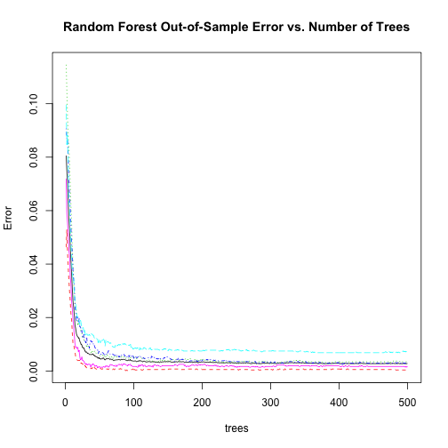
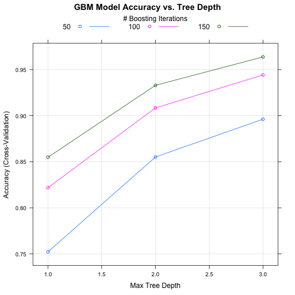

<!-- Copyright 2015, Seth A. Veitzer -->
## Predictive Machine Learning Modeling

### Executive Summary
<!-- describes and summarizes your analysis in at most 10 complete sentences. -->
This report describes a model for predictive machine learning of exercise quantification
using wearable technology. The Weight Lifting Exercise (WLE)  wearable accelerometer data, from
[Groupware@LES HAR project](http://groupware.les.inf.puc-rio.br/har#weight_lifting_exercises)
was collected for six study participants and classified according to how the exercise
was performed. More information on this dataset and the HAR project can be found in
Ref. [1]. 

One class (A) represents correct execution of the exercise, while four other
classes (B-E) represent common mistakes when performing the exercise. This report
demonstrates predictive machine learning modeling on a training subset of this data in
order to predict the class of execution on a testing subset. I build two different
predictive models using cross-validatoin on the training data set and estimate the 
out-of-sample error. The best predictive model is applied to the test dataset at 
the end of this report.

### Loading and cleaning the data
Training and testing datasets are loaded separately. Missing values in the data set
are either "NA" or empty, so the data is read so that both types of missing values
are written as "NA". Some of the columns in the data have no usable data. In addition,
some of the columns are not accelerometer data, such as the participant's names, which
could skew the predictive models. I remove both of these types of variables
from the data sets. Removing categorical data actually increases the overall out-of-sample
error, but is more robust because that data is heavily biased and skews the predictive
power for the testing data set.


```r
require(caret, quietly=TRUE, warn.conflicts=FALSE)

trainData<-read.csv('pml-training.csv', na.strings=c("NA",""))
trainData<-trainData[,colSums(is.na(trainData))==0]
trainData<-trainData[,8:ncol(trainData)]
testData<-read.csv('pml-testing.csv', na.strings=c("NA",""))
testData<-testData[,colSums(is.na(testData))==0]
testData<-testData[,8:ncol(testData)]
```

### Model Selection

In order to select the best predictive model for this data set, I build two
different models on the training data set; a random forest model, and a
generalized boosted regression model (GBM). In both cases, I use cross-validation 
*on the training data* only in order to estimate the out-of-sample error rates.
Cross-validation splits the training data into a training subset and validation
subset that are used for building predictive models and testing the out-of-sample 
accuracy of the models. The testing data set is never used for testing
the accuracy of the predictive models because this would lead to overfitting.
In the end, both types of models provide very good predictive accuracy, and either
one could be used to predict on the test data set.


```r
set.seed(92115)
mf2 <- randomForest(classe ~ ., data=trainData, trControl=trainControl(method='cv'))
mf3 <- train(classe ~ ., data=trainData, trControl=trainControl(method='cv'),method='gbm', verbose=F)
mf2
```

```
## 
## Call:
##  randomForest(formula = classe ~ ., data = trainData, trControl = trainControl(method = "cv")) 
##                Type of random forest: classification
##                      Number of trees: 500
## No. of variables tried at each split: 7
## 
##         OOB estimate of  error rate: 0.28%
## Confusion matrix:
##      A    B    C    D    E  class.error
## A 5578    2    0    0    0 0.0003584229
## B   10 3784    3    0    0 0.0034237556
## C    0    9 3412    1    0 0.0029222677
## D    0    0   22 3192    2 0.0074626866
## E    0    0    0    6 3601 0.0016634322
```

```r
mf3
```

```
## Stochastic Gradient Boosting 
## 
## 19622 samples
##    52 predictor
##     5 classes: 'A', 'B', 'C', 'D', 'E' 
## 
## No pre-processing
## Resampling: Cross-Validated (10 fold) 
## 
## Summary of sample sizes: 17662, 17659, 17660, 17659, 17659, 17661, ... 
## 
## Resampling results across tuning parameters:
## 
##   interaction.depth  n.trees  Accuracy   Kappa      Accuracy SD
##   1                   50      0.7522688  0.6859005  0.009245654
##   1                  100      0.8218838  0.7745372  0.006426138
##   1                  150      0.8548568  0.8163100  0.007104542
##   2                   50      0.8551642  0.8164784  0.006925804
##   2                  100      0.9084192  0.8841028  0.005161073
##   2                  150      0.9329337  0.9151234  0.005524436
##   3                   50      0.8961376  0.8685115  0.007645360
##   3                  100      0.9441955  0.9293805  0.003946843
##   3                  150      0.9637146  0.9540944  0.003676216
##   Kappa SD   
##   0.011710849
##   0.008050509
##   0.008942697
##   0.008791642
##   0.006547938
##   0.007012764
##   0.009674533
##   0.004999113
##   0.004659357
## 
## Tuning parameter 'shrinkage' was held constant at a value of 0.1
## Accuracy was used to select the optimal model using  the largest value.
## The final values used for the model were n.trees = 150,
##  interaction.depth = 3 and shrinkage = 0.1.
```

The random forest model gives and out-of-sample (oob) error estimate of 0.28%. 
The confusion matrix above shows that nearly all of the predicted classes based
on the training data are correct for the validation data (subset of all training
data), with very low class errors. Hence it is expected that when this model is
applied to the testing data, that the predictions should be accurate.

The GBM model gives an accuracy of 0.964 for the best model. 
The GBM model is also has very low out-of-sample errors, but is not as accurate
as the random forest model. The optimal GBM model uses 150 trees with an interaction
depth of 3 (the highest depth testing in the model). The accuracy of this model can
be improved by tuning the model parameters. However, since the estimated out-of-sample
error for this model is less than 4% with the default paramters, it is generally not
worth the additional time and memory required.

The plot below shows the random
forest model estimated out-of-sample error as a function of number of trees, colored by
the class errors. Above 100 trees or so the error decreases slowly, indicating that a
random forest model with 100 trees would capture the majority of errors for all exercise
classes.


```r
plot(mf2, main='Random Forest Out-of-Sample Error vs. Number of Trees')
```

 

The plot below shows the GBM model accuracy as a function of tree depth for different
numbers of boosting iterations. For a given number of iterations the model accuracy
increases with increasing depth. For a given depth, more iterations improves the model
predictive accuracy.

```r
plot(mf3, main='GBM Model Accuracy vs. Tree Depth')
```

 


### Model Tuning
I have also built the predictive models using a principal component analysis preprocessing
step (not shown here for brevity). However, the random forest model showed no improvement
in accuracy and the GBM model showed a decrease in out-of-sample accuracy when PCA 
preprocessing was used. Leave one out cross validation (LOOCV) and repeated cross validation
methods were also examined for the random forest model, but since the accuracy using 
10-fold cross validation (the default) is already very high, there was no significant
improvement in the model using these techniques. Increasing the number of iterations in the
GBM model (through the shrinkage parameter) increased the predictive accuracy, but again,
the tradeoff between performance and accuracy is not worth this kind of tuning of the models.

## Applying the Model to the Testing Data
The random forest model built on the training data set is used to predict the class of
exercise (A-E) on the testing data below. Since the estimated out-of-sample error from
the validation subset of the training data (from cross-validation) is very small using
this model, it is expected that the predictions for the 20 testing samples should all
be correct. The model is applied to the testing data set only once, so that the model is
not overfitted. Both the random forest model and the GBM model give the same predicted
classes on the test data, and sumbission of these predictions to the class project indicated
that the predictions were all correct.


```r
predict(mf2, newdata=testData)
```

```
##  1  2  3  4  5  6  7  8  9 10 11 12 13 14 15 16 17 18 19 20 
##  B  A  B  A  A  E  D  B  A  A  B  C  B  A  E  E  A  B  B  B 
## Levels: A B C D E
```

```r
predict(mf3, newdata=testData)
```

```
##  [1] B A B A A E D B A A B C B A E E A B B B
## Levels: A B C D E
```

## References

[1] Velloso, E.; Bulling, A.; Gellersen, H.; Ugulino, W.; Fuks, H.,
*Qualitative Activity Recognition of Weight Lifting Exercises*, 
**Proc. 4th International Conference in Cooperation with SIGCHI (Augmented Human '13)**, 
Stuttgart, Germany: ACM SIGCHI, 2013. 


Copyright 2015, Seth A. Veitzer
